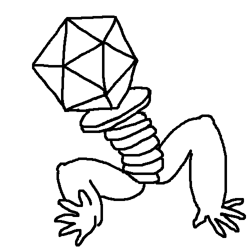

# PhageGame

Virtual CodeDay project w/ Desmond Kamas and Miguel V. (Kaweees)

## Installation Instructions
Download the game by clicking "Clone or Download" and then "Download ZIP."  Unzip the resulting file, then follow one of the sets of instructions below.

### With Python

1. Install Python 3.x.
2. Install the most recent version of Pygame (`pip install pygame` in cmd or terminal).
3. Run main.py (located at the project root).

### Without Python and on Windows

1. Open the `dist` folder, then open the `PhageGame` folder.
2. Run `PhageGame.exe`.

### If "Without Python" goes wrong...

The build created by Buff & Co. might not be compatible with your machine for a variety of reasons (including that you are using a Mac).  If this is the case, but you still wish to run an executable file, you can create your own as follows:
1. Complete steps 1 and 2 of the "With Python" section above.
2. Install the most recent version of PyInstaller (`pip install pyinstaller` in cmd or terminal).
3. Navigate to the project root (directory) using cmd or terminal.
4. Execute the following command: `pyinstaller --clean main.spec`
5. Upon successful execution of that command, the desired file will be located at `./dist/PhageGame/PhageGame.exe`  However, we aren't quite done yet...
6. At the time of writing, there is an issue with PyInstaller: it does not copy files with types not directly associated with Python (e.g. `.py`, `.pyd`, etc.) into the `dist` folder.  To resolve this issue, simply replace the `dist/PhageGame/pygame` folder and its contents with that and those of the folder containing Pygame on your machine (on Windows, this is usually `C:\Program Files (x86)\Python__-__\Lib\site-packages\pygame`; be careful not to delete what's there!).